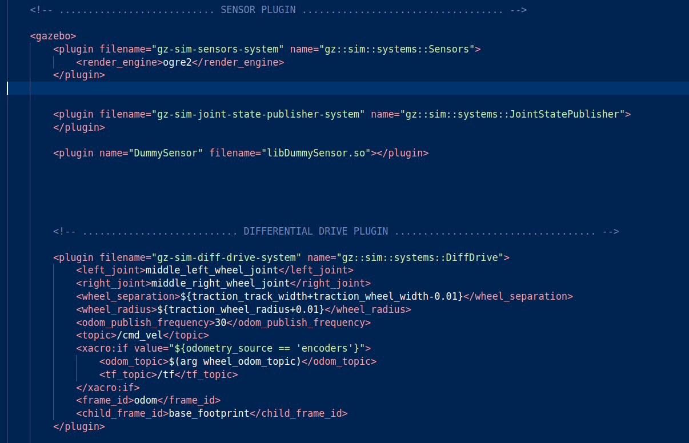

# Gazebo Harmonic Sensor Plugin 

I have made a simple custom sensor plugin for Gazebo Harmonic. You will be able to add it to your demo robot and load it in the simulation. On load, the sensor should publish “Hello World” into a ROS 2 topic using gz-transport.


## Some Considerations
So first I am running Gazebo Harmonic on ROS2 humble on ubuntu 22.04, so it is a non default pair. So I installed the non-default gazebo-ros2 pair through the binary package using the below link. If you have the default pairs of ROS_Gazebo then no need of installing anymore binary packages.

`https://gazebosim.org/docs/latest/ros_installation/`


## Installation
1 )  Make a ROS2 Workspace in your workspace, then clone the the repository in the src/ folder of the workspace 

2 ) Use rodep on the workspace to install all necessary dependendcies and the build the workspace using colcon build 

    
##  Demo and Some Explanations on Working
- To control the robot I used the differential drive plugin which creates a gztopic cmd_vel which is later remapped to the bcr_robot/cmd vel topic using the ros-gz-bridge and gz transport. I personally did not use the yaml file specify the directions of the ros-gz bridge communication rather i put them all in my launch file itself to make things simpler (check file launch/gz.launch.py). I have also put an examlple yaml file for your reference uf you dont want ot use the python launch file for this purpose


- I have used a 2 wheeled robot from Black Coffee Robotics and used the aws warehouse as the worldfile to replicate an intralogistic robotic environment

- The scripts/remapper.py folder im using to remap the bcr_robot/cmd_vel(ros2 topic formed after ros-gz bridge) to cmd_vel (ros2 topic on which the teleop keyboard puclishes the Twist message type). This is how i am able to drive the robot in the gazebo simulation. Use the below commands to run the simulation 


```javascript
ros2 launch <package_name> gz.launch.py
cd $~/ws/src/<package_name>/src/bcr_bot/scripts/ 
python3 remapper.py
ros2 run teleop_twist_keyboard teleop_twist_keyboard

```

[](https://www.youtube.com/watch?v=2X8w_7TlsGo)

▶️ Click the image above to watch the simulation demo on YouTube.


## Plugin Creation

- I have created a sensor plugin which publishes "Hello World " message to a gz topic /dummy_sensor_topic and it is remapped to a ros2 topic /dummy_sensor_topic using the gz-transport  . 

- In the scripts/dummy_sensor.cc file is where I have writtent the plugin. Note that this Plugin will not work on Gazebo classic. 
- Once you runt he simulation you can find the topic where the plugin is publishing using the below commands
- Also you can give different names to the two topics by proper remapping 
```javascript
gz topic -l
gz topic -e -t /dummy_sensor_topic
ros2 topic echo /dummy_sensor_topics


```



▶️ Dummy Sensor Plugin in Xacro file


[](https://www.youtube.com/watch?v=dr6-8dbpsQE)

▶️ Click the image above to watch the Custom Plugin demo on YouTube.

## Acknowledgements

 - Black Coffee Robotics for the lettting me use the chassis of their robot 

